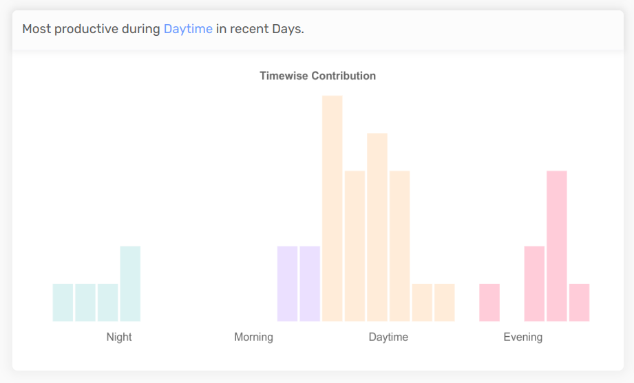
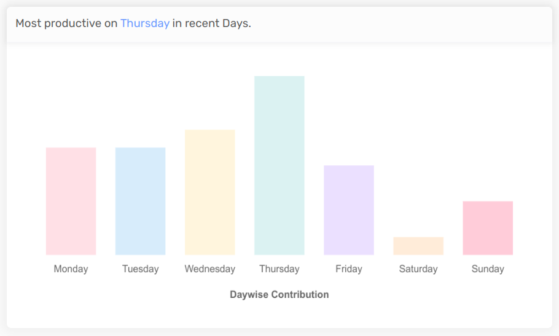
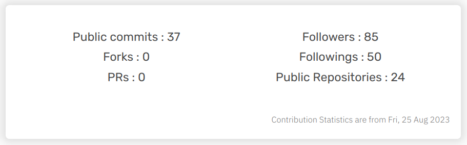
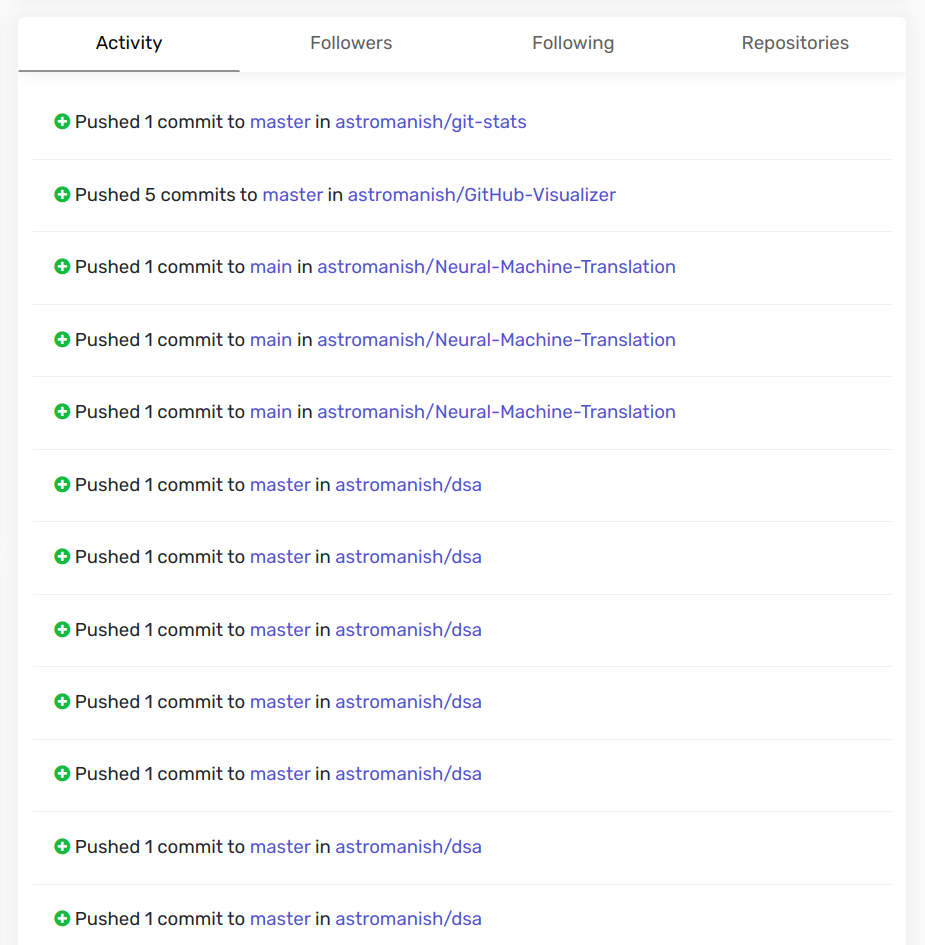

This project is a web application that allows you to search for any GitHub user online and view their profile, activity, and details in a dashboard-like page. You can also access their repositories and contributions from the dashboard.

## Features

- Search for any GitHub user by entering their username in the search page.

- View the user's profile, which includes basic user details like name, username, bio, and avatar.

- View the user's daily and weekly activity in bar charts, which relatively compare each hour and day of the week and also show the most active daytime, weekday of the user.

- View the user's details overview, which includes the number of followers, following, and repositories of the user.

- View the user's details, which include the list of followers, following, and repositories of the user. 

- You can click on any repository to go to the repository contribution page, which shows the github like contribution chart of the repository.

- The dashboard page is responsive and adapts to different screen sizes and orientations.

## Technologies

This project is built with the following technologies:

- React.js for the front-end development.
- Chart.js for the UI design and data visualization.
- GitHub API for fetching the user data and statistics.

## Installation and Usage

To run this project locally, you need to have Node.js (v16.16.0) and npm installed on your computer. Then, follow these steps:

- Clone this repository to your local machine.
- Navigate to the project directory and run `npm install` to install the dependencies.
- Run `npm start` to start the server and launch the application.
- Open your browser and go to `http://localhost:3000` to access the search page.
- Enter a GitHub username and click on the search button to view the user's dashboard.